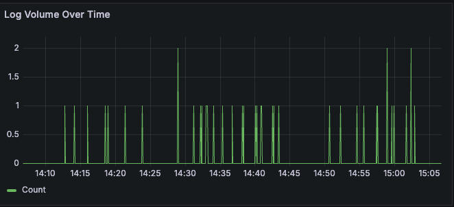
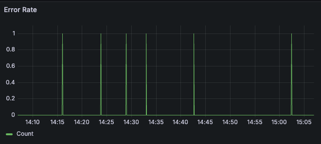
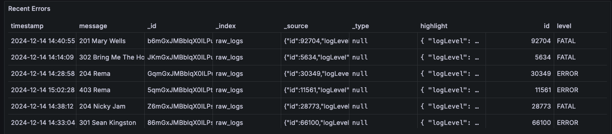
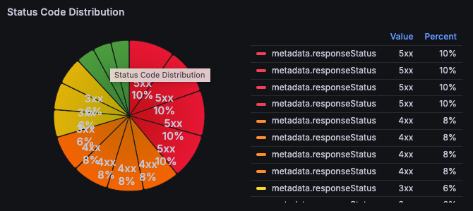
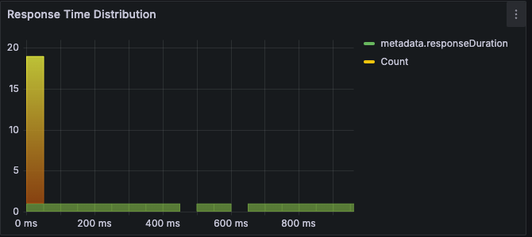

⭐ Star us on GitHub — it motivates us a lot!

[](https://twitter.com/intent/tweet?text=Check%20out%20Apexio%20-%20an%20amazing%20project%20by%20%40sidDarthVader31%20%0A%0ARepository%3A%20https%3A%2F%2Fgithub.com%2FsidDarthVader31%2Fapexio%0A%0A%23OpenSource%20%23GitHub)
[](https://www.facebook.com/sharer/sharer.php?u=https%3A%2F%2Fgithub.com%2FsidDarthVader31%2Fapexio)
[](https://www.linkedin.com/sharing/share-offsite/?url=https%3A%2F%2Fgithub.com%2FsidDarthVader31%2Fapexio)
[](https://www.reddit.com/submit?url=https%3A%2F%2Fgithub.com%2FsidDarthVader31%2Fapexio&title=Apexio%20-%20An%20Open%20Source%20Project)


## Table of Contents
- [Overview](#-overview)
- [Tech Stack](#-tech-stack)
- [Project Structure](#project-structure)
- [Modifications](#modifications)
- [Deployment](#-deployment)
- [Logging](#logging)

## 📖 Overview
Apexio is a self hosted log management and analysis platform. It aims to provide real-time insights, proactive monitoring and quick debugging assitance.
Apexio tries to provide a self hosted logging solution for a distributed 
environment for people who cannot pay for these services and
who do not want to reinvent the wheel. 
Apexio uses grafana for visualization of various key
important metrics -

1. Log volume (helps in identifying the traffic)

2. Error rate (gives insights on bugs in the system)

3. Error logs (for quick debugging)

4. Response code distribution(to find out types of errors)

5. Response time distribution(for monitoring slow services)



## 💻 Tech Stack 
-  [golang](https://go.dev/)
-  [kafka](https://kafka.apache.org/)
-  [docker](https://www.docker.com/)
-  [kubernetes](https://kubernetes.io/)
-  [grafana](https://grafana.com/)
-  [elasticsearch](https://www.elastic.co/elasticsearch)


##  <a id="project-structure"></a> 🗂️ Project Structure
For ease of development and management this repository is
currently a monolithic one but in a way that it can be
seperated pretty easily, 
each directory is a service which will have its separate
mod file and dockerfile

#### log_ingestion_service 
This provides two services REST and gRPC for your
application to interact and sent the logs for further
processing 

#### log_processing_service 
This service is responsible for processing and storing the
logs 

#### visualization_service 
This service helps in auto deployment of grafana dashboard
for proactive monitoring and analysis

#### deployments(k8)
This directory contains all the yaml files required to
deploy apexio via kubernetes 

The detailed project structure is given below -

```
.
├── LICENSE
├── README.md
├── log_ingestion_service
│   ├── sourcegrpc
│   └── sourceweb
│       ├── Dockerfile
│       ├── go.mod
│       ├── go.sum
│       └── main.go
├── log_processing_service
│   ├── Dockerfile
│   └── main.go
├── visualization_service
│   ├── Dockerfile
│   └── main.go
.
```

##  <a id="modifications"></a>  🛠️ Modifications 
**Kafka :** If you wish to have some other data stream
service instead of kafka, it is pretty simple to do that
too. Just pass on the service you wish to use during
server initialization. In main.go, replace this line

``` 
DataStreamService, errorData := datastream.CreateDataStream(context.Background(), "KAFKA")
```
with this - 
``` 
DataStreamService, errorData := datastream.CreateDataStream(context.Background(), "RABBIT_MQ")
```
Now update CreateDataStream function in Datastream service and add a case for your choice of data stream- 
``` 
case "RABBIT_MQ":
service, err := getNewRabbitMQStream()
if err != nil {
    fmt.Println("error while getting kafka service:", err)
    return nil, err
}
```
   
Create a new file `rabbitmq.go` and implement the
interface `IDataStream`  and you are good to go.

Note: You need to implement the code for
producing/consuming messsages as per your service
ofcourse. Refer to `kafka.go` file in `datastream`


## 🚀 Deployment 
1. Clone the repository
2. Build docker images -  
```
docker build -t source-web:1.0 /log_ingestion_service/.
docker build -t source-grpc:1.0 /log_ingestion_Service/.
docker build -t log-processing-service:1.0
/log_processing_service/.
```
3. Push these images in your registry 
4. start with kubernetes deployment
```
cd deployemtns/k8-config 

kc apply -f configMap/elasticsearch.yaml
kc apply -f configMap/kafka.yaml

kc apply -f secrets.elasticsearch.yaml
kc apply -f kafka.yaml 

kc apply deployments/elasticsearch.yaml
kc apply deployments/grafana.yaml
kc apply deployments/kafka.yaml
kc apply deployments/log_processing_service
kc apply deployments/source_grpc.yaml
kc apply deployments/source_web.yaml

kc apply -f ingress/grafana.yaml
```
5. Navigate to grafana dashboard and generate a new service account token (admin) and paste that token in
`deployments/k8-config/job/grafana.yaml` 
    
6. Run the grafana job to create data source and dashboard 
```
kc apply -f deployments/k8-config/job/grafana.yaml
```

Your dashboard will now be fully functional to receive
messages

## Logging 
1. For logging via REST API - 
    `POST  :<your_cluster_url>:3000/api/v1/log`
sample Request body - 
```
{
  "id":30,
  "metadata": {
    "requestId": "2",
    "clientIp": "36.75.63.226",
    "userAgent": "Opera/14.63 (Windows NT 5.2; U; TY Presto/2.9.172 Version/10.00)",
    "requestMethod": "DELETE",
    "requestPath": "/payments",
    "responseStatus": 502,
    "responseDuration": 194.67143993866,
    "extra": {
      "traceId": "58b45b69-e2c0-4cce-bc06-363d1bba3f31"
    }
  },
  "timestamp": 1732974309000,
  "logLevel": "INFO",
  "message": "502 Articulus despecto agnosco supra defero.",
  "source": {
    "host": "exotic-effector.name",
    "service": "payments",
    "environment": "production"
  }
}
```
Payload structure -

The following table describes the structure of the  request payload:


| Key | Type | Description |
| --- | --- | --- |
| id | uint | Unique identifier |
| metadata | Metadata | Metadata information |
| timestamp | uint64 | Timestamp of the log event |
| logLevel | string | Log level (e.g. DEBUG, INFO, ERROR) |
| message | string | Log message |
| source | Source | Source information |

### Metadata

The `Metadata` struct contains the following fields:


| Key | Type | Description |
| --- | --- | --- |
| requestId | string | Request ID |
| clientIp | string | Client IP address |
| userAgent | string | User agent string |
| requestMethod | string | Request method (e.g. GET, POST) |
| requestPath | string | Request path |
| responseStatus | int | Response status code |
| responseDuration | float32 | Response duration in seconds |
| extra | map[string]string | Additional metadata |

### Source

The `Source` struct contains the following fields:


| Key | Type | Description |
| --- | --- | --- |
| host | string | Hostname or IP address |
| service | string | Service name |
| environment | string | Environment name |
| extra | map[string]string | Additional source information |


2. For logging via gRPC - 
    `<your-cluster-curl>:3002 /IngestLog`
sample payload - 
```
{
    "entry": {
  "id":123123123,
  "metadata": {
    "requestId": "2",
    "clientIp": "36.75.63.226",
    "userAgent": "Opera/14.63 (Windows NT 5.2; U; TY Presto/2.9.172 Version/10.00)",
    "requestMethod": "DELETE",
    "requestPath": "/payments",
    "responseStatus": 502,
    "responseDuration": 194.67143993866,
    "extra": {
      "traceId": "58b45b69-e2c0-4cce-bc06-363d1bba3f31"
    }
  },
  "timestamp": 1733654342000,
  "logLevel": "INFO",
  "message": "502 Articulus despecto agnosco supra defero.",
  "source": {
    "host": "exotic-effector.name",
    "service": "payments",
    "environment": "production"
  }
}
}
```
You can also refer to `.proto` file in
`log_ingestion_service/source_grpc`
