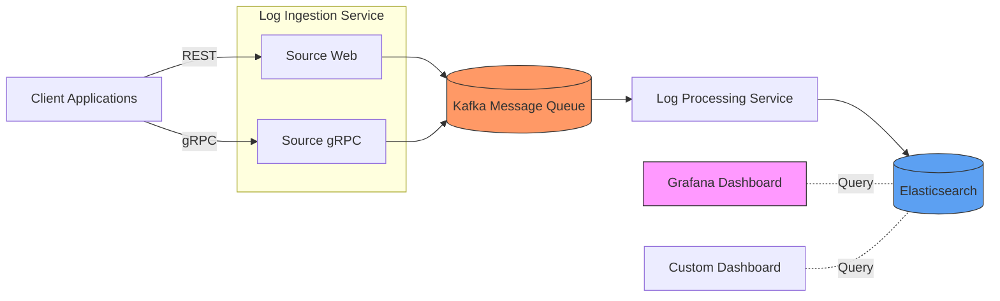

# Apexio - Self-Hosted Log Management Platform

<div align="center">
  
[](https://github.com/sidDarthVader31/apexio/stargazers)
[](https://github.com/sidDarthVader31/apexio/blob/main/LICENSE)
[](https://golang.org/)
[](https://kubernetes.io/)

**A comprehensive, self-hosted logging solution for distributed systems**

⭐ Star us on GitHub — it helps us reach more developers!

</div>

## 📋 Table of Contents

- [🔥 Quick Start](#-quick-start)
- [📖 Overview](#-overview)
- [✨ Features](#-features)  
- [🏗️ Architecture](#️-architecture)
- [💻 Tech Stack](#-tech-stack)
- [🚀 Installation](#-installation)
- [📊 Usage](#-usage)
- [⚙️ Configuration](#️-configuration)
- [🛠️ Contributing](#️-contributing)
- [🗺️ Roadmap](#️-roadmap)

## 🔥 Quick Start

Get Apexio running in under 5 minutes:

```bash
# Clone the repository
git clone https://github.com/sidDarthVader31/apexio.git
cd apexio

# Deploy with Docker Compose (local development)
docker-compose up -d

# Or deploy to Kubernetes (production)
kubectl apply -f deployments/k8-config/
```

Access your dashboard at `http://localhost:3000/grafana`

## 📖 Overview

**Apexio** is a powerful, self-hosted log management and analysis platform designed for teams who need enterprise-grade logging capabilities without the enterprise price tag. Built with modern microservices architecture, Apexio provides real-time insights, proactive monitoring, and comprehensive log management for distributed environments.

### Why Choose Apexio?

- **💰 Cost-Effective**: No expensive licensing fees or per-GB pricing
- **🔒 Data Privacy**: Keep your sensitive logs on your infrastructure
- **📈 Scalable**: Handle millions of log entries with ease
- **🎯 Real-time**: Get insights as they happen, not hours later
- **🔧 Customizable**: Adapt to your specific logging needs

## ✨ Features

### 📊 Comprehensive Monitoring Dashboard
- **Log Volume Tracking** - Monitor traffic patterns and system load
- **Error Rate Analysis** - Identify bugs and system issues quickly
- **Response Time Distribution** - Track application performance
- **Status Code Analysis** - Monitor HTTP response patterns
- **Real-time Error Logs** - Debug issues as they occur

### 🚀 High-Performance Ingestion
- **Dual Protocol Support** - REST API and gRPC endpoints
- **Batch Processing** - Efficient handling of high-volume logs
- **Message Queuing** - Kafka-based reliable log delivery
- **Auto-scaling** - Handle traffic spikes automatically

### 📈 Advanced Analytics
- **Grafana Integration** - Beautiful, customizable dashboards
- **Elasticsearch Storage** - Fast, full-text search capabilities
- **Real-time Queries** - Filter and search logs instantly
- **Historical Analysis** - Trend analysis and pattern recognition

## 🏗️ Architecture



### Service Components

| Service | Purpose | Technology |
|---------|---------|------------|
| **Log Ingestion** | Receives logs via REST/gRPC | Go, Gin, gRPC |
| **Log Processing** | Processes and stores logs | Go, Kafka Consumer |
| **Message Queue** | Reliable log delivery | Apache Kafka |
| **Storage** | Log storage and indexing | Elasticsearch |
| **Visualization** | Dashboards and analytics | Grafana |

## 💻 Tech Stack

<div align="center">

| Component | Technology | Version |
|-----------|------------|---------|
| **Backend** | Go | 1.21+ |
| **Message Queue** | Apache Kafka | 2.8+ |
| **Database** | Elasticsearch | 8.x |
| **Visualization** | Grafana | 10.x |
| **Orchestration** | Kubernetes | 1.25+ |
| **Containerization** | Docker | 20.x |

</div>

## 🚀 Installation

### Prerequisites

- **Kubernetes Cluster** (1.25+) or **Docker** (20.x+)
- **kubectl** configured for your cluster
- **Minimum Resources**: 4 CPU cores, 8GB RAM, 50GB storage

### Option 1: Kubernetes Deployment (Recommended for Production)

1. **Clone and prepare the repository**
   ```bash
   git clone https://github.com/sidDarthVader31/apexio.git
   cd apexio
   ```

2. **Build and push Docker images**
   ```bash
   # Build images
   docker build -t your-registry/apexio-source-web:1.0 ./log_ingestion_service/source_web
   docker build -t your-registry/apexio-source-grpc:1.0 ./log_ingestion_service/source_grpc  
   docker build -t your-registry/apexio-log-processor:1.0 ./log_processing_service

   # Push to your registry
   docker push your-registry/apexio-source-web:1.0
   docker push your-registry/apexio-source-grpc:1.0
   docker push your-registry/apexio-log-processor:1.0
   ```

3. **Update image references**
   ```bash
   # Update deployment files with your registry URLs
   find deployments/k8-config/deployments -name "*.yaml" -exec sed -i 's/apexio-/your-registry\/apexio-/g' {} \;
   ```

4. **Deploy infrastructure components**
   ```bash
   cd deployments/k8-config

   # Deploy ConfigMaps and Secrets
   kubectl apply -f configMap/
   kubectl apply -f secrets/

   # Deploy core services
   kubectl apply -f deployments/elasticsearch.yaml
   kubectl apply -f deployments/kafka.yaml
   ```

5. **Deploy Apexio services**
   ```bash
   kubectl apply -f deployments/log-processing-service.yaml
   kubectl apply -f deployments/source-web.yaml
   kubectl apply -f deployments/source-grpc.yaml
   kubectl apply -f deployments/grafana.yaml
   ```

6. **Setup Grafana dashboard**
   ```bash
   # Create Grafana ingress
   kubectl apply -f ingress/grafana.yaml

   # Get Grafana admin password
   kubectl get secret grafana-admin -o jsonpath="{.data.password}" | base64 --decode

   # Generate service account token in Grafana UI and update job config
   # Edit deployments/k8-config/job/grafana.yaml with the token

   # Run dashboard setup job
   kubectl apply -f job/grafana.yaml
   ```

### Option 2: Docker Compose (Development)

```bash
# Coming soon - Docker Compose setup
# Check our issues for Docker Compose implementation progress
```

### Verification

Check if all services are running:

```bash
kubectl get pods -n apexio
kubectl get services -n apexio
```

Access Grafana dashboard:
- **URL**: `http://your-cluster-ip:3000` or through ingress
- **Login**: admin / [password from secrets]

## 📊 Usage

### Sending Logs to Apexio

#### REST API Endpoint

**URL**: `POST http://your-cluster-url:3000/api/v1/log`

**Sample Request**:
```bash
curl -X POST http://your-cluster-url:3000/api/v1/log \
  -H "Content-Type: application/json" \
  -d '{
    "id": 12345,
    "metadata": {
      "requestId": "req-001",
      "clientIp": "192.168.1.100",
      "userAgent": "Mozilla/5.0...",
      "requestMethod": "POST",
      "requestPath": "/api/users",
      "responseStatus": 201,
      "responseDuration": 156.23,
      "extra": {
        "traceId": "trace-abc-123",
        "spanId": "span-def-456"
      }
    },
    "timestamp": 1733654342000,
    "logLevel": "INFO",
    "message": "User created successfully",
    "source": {
      "host": "api-server-01",
      "service": "user-service",
      "environment": "production"
    }
  }'
```

#### gRPC Endpoint

**URL**: `your-cluster-url:3002`

Use the `.proto` file in `log_ingestion_service/source_grpc/log_payload.proto` to generate client code.

**Sample gRPC Call** (using grpcurl):
```bash
grpcurl -plaintext -d '{
  "entry": {
    "id": 12345,
    "metadata": {
      "requestId": "req-001",
      "clientIp": "192.168.1.100",
      "userAgent": "Mozilla/5.0...",
      "requestMethod": "POST", 
      "requestPath": "/api/users",
      "responseStatus": 201,
      "responseDuration": 156.23,
      "extra": {
        "traceId": "trace-abc-123"
      }
    },
    "timestamp": 1733654342000,
    "logLevel": "INFO",
    "message": "User created successfully",
    "source": {
      "host": "api-server-01",
      "service": "user-service", 
      "environment": "production"
    }
  }
}' your-cluster-url:3002 logging.LoggingService/IngestLog
```

### Log Schema Reference

| Field | Type | Description | Required |
|-------|------|-------------|----------|
| `id` | uint64 | Unique identifier for the log entry | ✅ |
| `timestamp` | uint64 | Unix timestamp in milliseconds | ✅ |
| `logLevel` | string | Log level (DEBUG, INFO, WARN, ERROR, FATAL) | ✅ |
| `message` | string | Human-readable log message | ✅ |
| `metadata` | object | Request/response metadata | ❌ |
| `source` | object | Source system information | ❌ |

#### Metadata Schema

| Field | Type | Description |
|-------|------|-------------|
| `requestId` | string | Unique request identifier |
| `clientIp` | string | Client IP address |
| `userAgent` | string | User agent string |
| `requestMethod` | string | HTTP method (GET, POST, etc.) |
| `requestPath` | string | API endpoint path |
| `responseStatus` | int32 | HTTP response code |
| `responseDuration` | float64 | Response time in milliseconds |
| `extra` | map<string,string> | Additional metadata |

#### Source Schema

| Field | Type | Description |
|-------|------|-------------|
| `host` | string | Hostname or IP address |
| `service` | string | Service name |
| `environment` | string | Environment (dev, staging, prod) |
| `extra` | map<string,string> | Additional source information |

### Dashboard Features

Once logs are flowing, access your Grafana dashboard to:

- **Monitor Log Volume** - Track traffic patterns over time
- **Analyze Error Rates** - Identify spikes in errors or failures
- **View Recent Errors** - See detailed error logs in real-time
- **Response Time Analysis** - Monitor application performance
- **Status Code Distribution** - Understand response patterns

## ⚙️ Configuration

### Environment Variables

| Service | Variable | Default | Description |
|---------|----------|---------|-------------|
| All | `MESSAGE_BROKER` | `KAFKA` | Message broker type |
| Log Ingestion | `PORT` | `3000`/`3002` | Service port |
| Log Processing | `ELASTICSEARCH_URL` | - | Elasticsearch connection URL |
| Kafka | `KAFKA_BROKERS` | `kafka:9092` | Kafka broker addresses |

### Customizing Message Brokers

Apexio supports pluggable message brokers. To use RabbitMQ instead of Kafka:

1. **Update the main.go in log_processing_service**:
   ```go
   DataStreamService, errorData := datastream.CreateDataStream(context.Background(), "RABBIT_MQ")
   ```

2. **Implement RabbitMQ service**:
   Create `rabbitmq.go` implementing the `IDataStream` interface.

3. **Update configuration**:
   Set `MESSAGE_BROKER=RABBIT_MQ` in your environment variables.

### Scaling Configuration

For high-traffic environments, consider:

- **Kafka Partitions**: Increase partitions for parallel processing
- **Elasticsearch Shards**: Distribute data across multiple shards
- **Replica Scaling**: Use Kubernetes HPA for auto-scaling
- **Resource Limits**: Set appropriate CPU/memory limits

## 🛠️ Contributing

We welcome contributions from the community! Here's how you can help:

### Getting Started

1. **Fork the repository**
2. **Create a feature branch**
   ```bash
   git checkout -b feature/amazing-feature
   ```
3. **Make your changes**
4. **Test thoroughly**
5. **Submit a pull request**

### Development Setup

```bash
# Clone your fork
git clone https://github.com/your-username/apexio.git
cd apexio

# Install Go dependencies
cd log_ingestion_service/source_web && go mod download
cd ../source_grpc && go mod download  
cd ../../log_processing_service && go mod download

# Run services locally
docker-compose -f docker-compose.dev.yml up -d

# Start individual services for development
cd log_ingestion_service/source_web && go run main.go
```

### Contributing Guidelines

#### Code Standards
- **Language**: Go 1.21+ with standard formatting
- **Documentation**: Comment all public functions and types
- **Testing**: Include unit tests for new features
- **Commits**: Use conventional commit messages

#### Areas for Contribution

**🎯 High Priority**
- Docker Compose setup for easy local development
- Helm charts for Kubernetes deployment
- Additional message broker implementations (RabbitMQ, Redis)
- Performance optimizations

**🔧 Medium Priority**  
- Log parsing and enrichment features
- Alert rule templates
- Multi-tenancy support
- Log retention policies

**🌟 Nice to Have**
- Machine learning anomaly detection
- Custom dashboard templates
- Log forwarding to external systems
- Mobile dashboard support

#### Reporting Issues

When reporting bugs:
- Use the issue templates
- Include reproduction steps
- Attach relevant logs
- Specify your environment details

### Code Review Process

1. All PRs require at least one review
2. CI/CD checks must pass
3. Documentation updates required for new features
4. Breaking changes need migration guides

## 🗺️ Roadmap

### Version 1.1 (Next Release)
- [ ] Docker Compose setup
- [ ] Helm chart deployment
- [ ] Enhanced error handling
- [ ] Performance benchmarks

### Version 1.2
- [ ] RabbitMQ message broker support  
- [ ] Log retention policies
- [ ] Advanced filtering capabilities
- [ ] API rate limiting

### Version 2.0 (Future)
- [ ] Machine learning anomaly detection
- [ ] Multi-tenancy support
- [ ] Advanced alerting rules
- [ ] Log forwarding connectors

### Security & Performance
- [ ] TLS encryption for all communications
- [ ] Authentication and authorization
- [ ] Log sampling for high-volume systems
- [ ] Distributed deployment patterns

### Long-term Vision
- [ ] AI-powered log analysis
- [ ] Mobile dashboard application
- [ ] SaaS offering option
- [ ] Enterprise features (SSO, RBAC)

---

<div align="center">

## 📄 License

This project is licensed under the Apache License 2.0 - see the [LICENSE](LICENSE) file for details.

## 🤝 Community

[](https://github.com/sidDarthVader31/apexio/discussions)
[](https://github.com/sidDarthVader31/apexio/issues)

**Made with ❤️ by the Apexio team**

⭐ **Star us on GitHub if Apexio helps you!** ⭐

</div>
