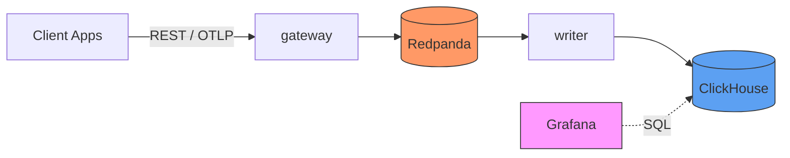

# Apexio - Self-Hosted Log Management Platform

<div align="center">
  
[](https://github.com/sidDarthVader31/apexio/stargazers)
[](https://github.com/sidDarthVader31/apexio/blob/main/LICENSE)
[](https://golang.org/)
[](https://kubernetes.io/)

**A clone-and-adapt push-based log backend for distributed systems**

⭐ Star us on GitHub — it helps us reach more developers!

</div>

## 📋 Table of Contents

- [🔥 Quick Start](#-quick-start)
- [📖 Overview](#-overview)
- [✨ Features](#-features)
- [🏗️ Architecture](#️-architecture)
- [💻 Tech Stack](#-tech-stack)
- [🚀 Installation](#-installation)
- [📊 Usage](#-usage)
- [⚙️ Configuration](#️-configuration)
- [🧪 Testing](#-testing)
- [🛠️ Contributing](#️-contributing)
- [🗺️ Roadmap](#️-roadmap)

## 🔥 Quick Start

Get Apexio running locally in a few minutes:

```bash
git clone https://github.com/sidDarthVader31/apexio.git
cd apexio

make up          # Docker Compose: gateway, writer, Redpanda, ClickHouse, Grafana
make test        # fast: unit + contracts + k8s manifest validation
make test-e2e    # full compose pipeline (tears down stack on exit)
```

| What | URL |
|------|-----|
| **Grafana dashboard** | [http://127.0.0.1:3000/d/apexio-logs/apexio-logs](http://127.0.0.1:3000/d/apexio-logs/apexio-logs) (`admin` / `admin`) |
| **Gateway REST** | `POST http://127.0.0.1:18080/api/v1/log` |
| **Gateway OTLP HTTP** | `POST http://127.0.0.1:18080/v1/logs` |
| **Gateway OTLP gRPC** | `:4317` |

Send a test log:

```bash
curl -sS -X POST http://127.0.0.1:18080/api/v1/log \
  -H 'Content-Type: application/json' \
  -d '{
    "id": 1,
    "timestamp": 1732974309000,
    "logLevel": "INFO",
    "message": "hello apexio",
    "source": {"service": "demo", "host": "localhost", "environment": "dev"}
  }'
```

For Kubernetes (kind / minikube), see [deploy/k8s/README.md](deploy/k8s/README.md).

## 📖 Overview

**Apexio** is an open-source, self-hosted log pipeline you **fork and adapt** per organization. It is not a hosted SaaS — you own the data, the broker, and the auth layer.

```
Client → gateway (REST + OTLP) → Redpanda → writer → ClickHouse → Grafana
```

### Why Choose Apexio?

- **💰 Cost-Effective** — No per-GB SaaS pricing; run on your infra
- **🔒 Data Privacy** — Logs stay in your VPC or laptop
- **📈 Scalable** — Kafka-compatible broker + columnar storage
- **🎯 Real-time** — Push ingest, batched writes, live dashboards
- **🔧 Adaptable** — Swap broker, auth, or storage via Go interfaces

## ✨ Features

### 📊 Grafana Dashboards (as code)
- **Log volume** — traffic over time
- **Error rate** — spot spikes quickly
- **Recent errors** — tail failing requests
- **Response time & status code** — HTTP performance panels
- Provisioned from `deploy/grafana/provisioning/` — no manual setup

### 🚀 High-Performance Ingestion
- **REST** — `POST /api/v1/log` JSON body
- **OTLP** — HTTP `/v1/logs` and gRPC `:4317` (OpenTelemetry logs)
- **Batched writer** — configurable batch size, flush interval, retries
- **Prometheus metrics** — gateway and writer `/metrics` endpoints

### 🔌 Extension Points
- **Auth** — optional API-key middleware (`pkg/auth`); plug in JWT, mTLS, or your IdP
- **Broker** — `broker.Broker` interface; default Redpanda, swap for Kafka/NATS/etc.
- **Store** — `store.Store` interface; default ClickHouse

## 🏗️ Architecture


```mermaid
flowchart LR
    Client[Client Apps]
    Gateway[gateway]
    Redpanda[(Redpanda)]
    Writer[writer]
    ClickHouse[(ClickHouse)]
    Grafana[Grafana]

    Client -->|REST / OTLP| Gateway
    Gateway --> Redpanda
    Redpanda --> Writer
    Writer --> ClickHouse
    Grafana -.->|SQL| ClickHouse

    style Redpanda fill:#f96,stroke:#333
    style ClickHouse fill:#5ca0f2,stroke:#333
    style Grafana fill:#f9f,stroke:#333
```

### Service Components

| Component | Purpose | Location |
|-----------|---------|----------|
| **gateway** | REST + OTLP ingest, optional auth | `cmd/gateway` |
| **writer** | Consume broker, batch insert | `cmd/writer` |
| **Redpanda** | Durable log queue (Kafka API) | `deploy/compose`, `deploy/k8s` |
| **ClickHouse** | Columnar log storage | `deploy/clickhouse` |
| **Grafana** | Dashboards & exploration | `deploy/grafana` |

Shared contracts live in [`pkg/`](pkg/README.md) (`schema`, `broker`, `store`, `auth`).

## 💻 Tech Stack

<div align="center">

| Component | Technology | Version |
|-----------|------------|---------|
| **Services** | Go | 1.23+ |
| **Message queue** | Redpanda (Kafka API) | latest |
| **Database** | ClickHouse | 24.x |
| **Visualization** | Grafana + ClickHouse plugin | 11.x |
| **Orchestration** | Docker Compose / Kubernetes | — |

</div>

## 🚀 Installation

### Prerequisites

- **Docker** 20.x+ and **Docker Compose** v2 (local dev)
- **Go** 1.23+ (build from source, run tests)
- **kubectl** + **kind** or **minikube** (optional, for K8s)

### Option 1: Docker Compose (recommended for dev)

```bash
git clone https://github.com/sidDarthVader31/apexio.git
cd apexio

cp .env.example .env   # optional: API key, batch tuning
make up
make test-e2e          # optional: full pipeline verification
```

Stop the stack: `make down`. Reset data: `make clean-volumes`.

Full deploy docs: [deploy/README.md](deploy/README.md).

### Option 2: Kubernetes (kind / minikube)

```bash
kind create cluster --name apexio
docker build -t apexio-gateway:local -f cmd/gateway/Dockerfile .
docker build -t apexio-writer:local -f cmd/writer/Dockerfile .
kind load docker-image apexio-gateway:local apexio-writer:local --name apexio
kubectl apply -k deploy
```

See [deploy/k8s/README.md](deploy/k8s/README.md) for smoke tests, NodePorts, and teardown.

## 📊 Usage

### REST ingest

```bash
curl -X POST http://127.0.0.1:18080/api/v1/log \
  -H "Content-Type: application/json" \
  -d '{
    "id": 12345,
    "timestamp": 1733654342000,
    "logLevel": "INFO",
    "message": "User created successfully",
    "metadata": {
      "requestId": "req-001",
      "requestMethod": "POST",
      "requestPath": "/api/users",
      "responseStatus": 201,
      "responseDuration": 156.23
    },
    "source": {
      "host": "api-server-01",
      "service": "user-service",
      "environment": "production"
    }
  }'
```

### OTLP ingest

```bash
go run ./examples/sample-client -mode otlp -message "hello otlp" -service demo
# or both REST + OTLP
go run ./examples/sample-client -mode both
```

### Query ClickHouse

```bash
docker exec apexio-clickhouse clickhouse-client --query \
  "SELECT timestamp, service, log_level, message FROM apexio.logs ORDER BY timestamp DESC LIMIT 10"
```

### Log schema reference

| Field | Type | Description | Required |
|-------|------|-------------|----------|
| `id` | uint64 | Unique log identifier | ✅ |
| `timestamp` | uint64 | Unix epoch milliseconds | ✅ |
| `logLevel` | string | DEBUG, INFO, WARN, ERROR, FATAL | ✅ |
| `message` | string | Log message | ✅ |
| `metadata` | object | HTTP / request metadata | ❌ |
| `source` | object | host, service, environment | ❌ |

Canonical in-process type: `schema.LogEvent` in [`pkg/schema`](pkg/schema/event.go).

## ⚙️ Configuration

Copy [`.env.example`](.env.example) to `.env` (never commit secrets).

| Variable | Default | Description |
|----------|---------|-------------|
| `GATEWAY_API_KEY` | _(empty)_ | Enable API-key auth when set |
| `GATEWAY_API_KEY_HEADER` | `X-API-Key` | Header name for API key |
| `REDPANDA_BROKERS` | `localhost:19092` | Kafka API brokers |
| `LOG_TOPIC` | `logs.ingestion.raw.v1` | Ingest topic |
| `CLICKHOUSE_ADDR` | `localhost:9000` | Native protocol |
| `WRITER_BATCH_SIZE` | `50` | Events per flush |
| `WRITER_FLUSH_INTERVAL` | `1s` | Time-based flush |

Broker delivery policy and backpressure: [`pkg/broker/README.md`](pkg/broker/README.md).

### Bring your own auth / broker

- **Auth** — extend or replace middleware in `cmd/gateway`; see `pkg/auth`
- **Broker** — implement `broker.Broker`, wire in gateway + writer
- **Store** — implement `store.Store` for alternate backends

## 🧪 Testing

```bash
make test              # unit + contracts + k8s manifests (fast)
make test-e2e          # compose E2E suite
make test-k8s-e2e      # cluster smoke (opt-in, tears down namespace)
make test-docs         # no legacy paths; README smoke checks
```

Component tests: `make test-unit`, `test-contracts`, `test-infra`, `test-pipeline`, `test-otlp`, `test-grafana`, `test-auth`, `test-k8s`.

Details: [test.md](test.md).

## 🛠️ Contributing

We welcome contributions!

1. Fork the repository
2. Create a feature branch: `git checkout -b feature/my-change`
3. Run `make test` (and `make test-e2e` for pipeline changes)
4. Open a pull request

### Development setup

```bash
git clone https://github.com/your-username/apexio.git
cd apexio
go test ./... -count=1
make up
```

### Areas for contribution

- Helm chart or production K8s overlays
- Additional broker implementations (NATS, RabbitMQ)
- OTLP auth / TLS termination examples
- Performance benchmarks and load tests

## 🗺️ Roadmap

### Shipped
- [x] Docker Compose full stack
- [x] REST + OTLP ingest
- [x] Redpanda → ClickHouse pipeline with batched writer
- [x] Grafana dashboards as code
- [x] Optional API-key auth
- [x] Kubernetes manifests (Kustomize)

### Next
- [ ] Helm chart
- [ ] Production hardening guide (TLS, HPA, backups)
- [ ] Log retention / TTL policies in ClickHouse
- [ ] Additional exporter examples

### Future
- [ ] Multi-tenancy patterns
- [ ] Alert rule templates
- [ ] OpenTelemetry traces correlation

---

<div align="center">

## 📄 License

This project is licensed under the Apache License 2.0 — see the [LICENSE](LICENSE) file for details.

## 🤝 Community

[](https://github.com/sidDarthVader31/apexio/discussions)
[](https://github.com/sidDarthVader31/apexio/issues)

**Made with ❤️ by the Apexio team**

⭐ **Star us on GitHub if Apexio helps you!** ⭐

</div>
